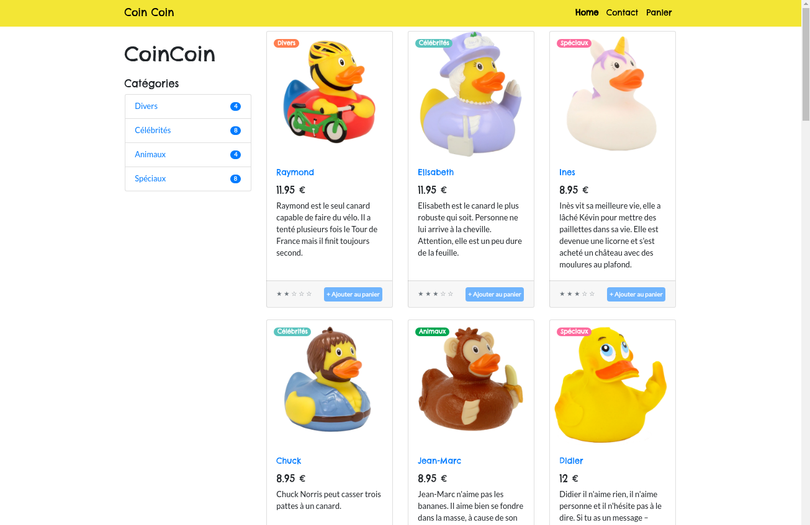

# Boutique de canards en plastique

La boutique Coin Coin est une mine d'or pour tous développeur.se qui se respecte !

Chaque utilisateur a la possibilité de parcourir les canards en plastique et les ajouter au panier via la page d'accueil ou en utilisant les onglets présents dans "catégories".   
Lorsqu'il clique sur l'article, il peut consulter les avis laissés par les acheteurs (modale).   
Il a aussi accès à sa page panier, sur laquelle il a la possibilité d'ajouter des canards supplémentaires ou d'en supprimer (panier valable 60 min).  
Enfin, il peut laisser un message en utilisant la une page contact.

J'ai entièrement réalisé ce projet Node.js lors de mon deuxième mois de formation en développement web FS JavaScript.

Ce site est responsive et respecte les "bonnes pratiques SEO".

## Réalisation

J'ai utilisé Express et pour organiser mon code, je me suis basée sur l'architecture MVC.  
J'ai codé ce projet en 2 jours (création de la base de données comprise).

## Languages utilisés 

- HTML5, CSS3
- JavaScript 
- SQL 
  
## Stacks
 - Node.js
 - Express
 - Express-session
 - ejs
 - Bootstrap
 - PostgreSQL (avec tables relationnelles)

 

## Screenshots

### Home page


### Article page


### Modal review


### Category page


### Cart page


### Contact page


## Installation 

1. Cloner le repo 
- en utilisant la clé SSH
```
git clone git@github.com:sarah-maau/boutique-coin-coin.git
```
- en utilisant HTTPS
```
git clone https://github.com/sarah-maau/boutique-coin-coin.git
```

2. Installer les dépendances 

```
npm i
```

3. Créer une base de données, puis chargez les tables et les données 
   
```
psql -d <nom de la base de données> -f ./database/create_db.sql
```

4. Créer un fichier .env reprenant les informations fournies dans le document `.env.example`
   

5. Lancer le script

```
npm start
```

## Licence
Ce projet est sous licence MIT - voir le fichier `LICENSE` pour plus de détails
